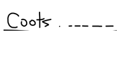
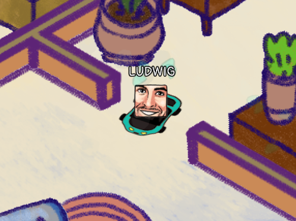

# Cootsmania

[**PLAY THE GAME HERE**](https://kuviman.itch.io/cootsmania)

Use arrow keys to race around the house and get to Coots before other players do.

On each round, half of the players get eliminated.
Survive all the rounds and become the CHAMPION!

## GAMEPLAY

- Enter your name, pick your emote and a color for your car.  
- Wait for the current game to end.
- Each round, a text will be shown hinting where Coots is at the moment.
- If Coots is out of your screen, you will see an indicator showing where it is.
- Drift your way through the obstacles and reach coots.
- If you reach Coots earlier than half of the players, you are qualified for the next round.
- If you cannot reach Coots in 24 Seconds, you are eliminated.

## Made by

- [kuviman](https://github.com/kuviman) - Programming
- [Rincs](https://rincsart.com) - Art
- [Brainoid](https://twitter.com/brainoidgames) - Music & Sfx

## Build instructions

You will need a [Rust compiler](https://rustup.rs)

Then just running `cargo run --release` should compile (for a while) and start the game with local server so you can play against bots

## Running your own server

If you want to run your own private server, here are the instructions:

- `cargo build --release` will get you an executable at `target/release/cootsmania.exe` (if you use linux/macos, its similar)
  
  `cootsmania.exe`, `config.json`, `level.json` and `assets` all in the same folder are required to run executable without using `cargo` (`bots.data` also if you wish to run server with the bots)
- To run the server, do `cootsmania.exe --server 0.0.0.0:1155`, or any other port
- To run native client connecting to the server, do `cootsmania.exe --connect ws://server.com:1155`
- ssl (`wss://`) is not enabled on native builds, if you want to run server with https, you can proxy secure websocket to the app using e.g `nginx` or `caddy`. To connect to such server you'll need a web client (or change some sources ¯\\_(ツ)_/¯ (enable some feature of the `ws` crate))
- building a web version can be done using `cargo-geng` helper (you may see usage in [GitHub Actions](.github/workflows/flow.yml))

  what it does is basically building for `wasm32-unknown-unknown` target, then running `wasm-bindgen`, and then `wasm-opt`

  connecting to the server using web build is possible by opening it like `index.html?connect=ws://server.com:1155` - query work as cli args
  
  or you can provide `CONNECT` env variable during the build of the web client to auto connect without query
